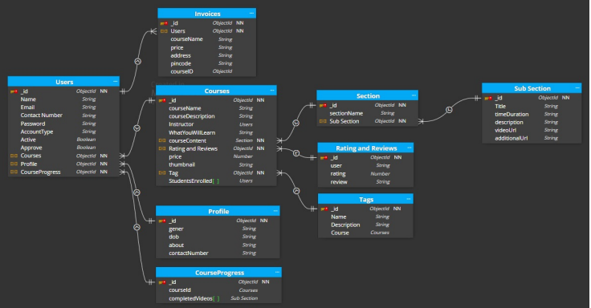

# CourseIT: AI-Powered EdTech Platform with Real-Time Gaze & Posture Telemetry and Web-Based Code Execution

CourseIT is an advanced e-learning ecosystem built on the MERN stack (MongoDB, Express, React, Node.js) that bridges the pedagogical gap in asynchronous digital education. By integrating local, webcam-based computer vision telemetry and an interactive programming environment, the platform enables detailed attention tracking and physical ergonomic feedback without compromising user privacy.

---

## 📸 Application Preview


---

## 🚀 Key Features

*   **Privacy-First Real-Time Telemetry**: Uses Google MediaPipe models running locally in the browser via WebAssembly (WASM). No raw video data is transmitted to the server; only lightweight attention scores and ergonomic flags are logged at 10-second intervals.
*   **State-Controlled Camera Lifecycle**: Physical camera activity is bound to the video player state. The webcam stream boots instantly when a lecture starts and shuts down completely (releasing hardware tracks) when paused, ended, or upon page navigation.
*   **Monaco-Powered Code Sandbox**: An in-browser IDE utilizing the Monaco Editor engine to support syntax highlighting, code autocompletion, and multi-language compilation. JavaScript is evaluated locally in a secure client sandbox.
*   **Instructor Analytics Dashboard**: Interactive charts (Recharts) aggregating attention span distributions, gaze drift patterns, and posture warnings to help educators locate and improve unengaging course segments.
*   **Secure Role-Based Authentication**: Secure sign-up, sign-in, and password recovery routes utilizing JWT tokens, HTTP-only cookie storage, and OTP verification via email.

---

## 📐 Mathematical Telemetry Models

All computer vision tracking runs locally on client-side threads (CPU/GPU) at sub-30ms intervals.

### 1. Gaze Direction & Eye Focus Vector
Gaze direction is computed using Google MediaPipe Face Mesh by isolating eye and nose coordinates:
*   **Nose Tip Landmark** ($L_{\text{nose}}$): Landmark index `1`
*   **Left Eye Outer Corner** ($L_{\text{left}}$): Landmark index `33`
*   **Right Eye Outer Corner** ($L_{\text{right}}$): Landmark index `263`

First, the eye center coordinate ($C_{\text{eye}}$) along the horizontal X-axis is calculated:
$$C_{\text{eye}} = \frac{L_{\text{left}}.x + L_{\text{right}}.x}{2}$$

Next, the nose displacement offset ($\Delta_{\text{nose}}$) relative to the eye center is determined:
$$\Delta_{\text{nose}} = L_{\text{nose}}.x - C_{\text{eye}}$$

Head rotation and gaze direction are classified using this displacement delta:
*   **Looking Left**: $\Delta_{\text{nose}} > 0.03$
*   **Looking Right**: $\Delta_{\text{nose}} < -0.03$
*   **Looking At Screen**: $-0.03 \le \Delta_{\text{nose}} \le 0.03$

### 2. Ergonomic Posture Assessment
Posture quality is evaluated by analyzing shoulder and head alignments using the MediaPipe Pose Landmarker:
*   **Nose Position** ($P_{\text{nose}}$): Landmarker index `0`
*   **Left Shoulder** ($P_{\text{left\_shoulder}}$): Landmarker index `11`
*   **Right Shoulder** ($P_{\text{right\_shoulder}}$): Landmarker index `12`

The vertical midpoint of the shoulders ($S_{\text{midpoint}}$) along the Y-axis is computed:
$$S_{\text{midpoint}} = \frac{P_{\text{left\_shoulder}}.y + P_{\text{right\_shoulder}}.y}{2}$$

The vertical distance ($D_{\text{head}}$) representing head-neck extension is calculated:
$$D_{\text{head}} = S_{\text{midpoint}} - P_{\text{nose}}.y$$

Ergonomic posture is graded based on $D_{\text{head}}$:
*   **Ergonomic / Good Posture**: $D_{\text{head}} > 0.25$
*   **Slouched / Poor Posture**: $D_{\text{head}} \le 0.25$

---

## 🏗️ System Architecture

The interaction model of the platform components, services, and APIs is detailed below:


### Database Schema Map
The underlying MongoDB collection relationships and data flows are structured as follows:



---

## 🛠️ Tech Stack

### Frontend (Client)
*   **React.js** (v18.2.0)
*   **Redux Toolkit** (State Management)
*   **Tailwind CSS** (Styling)
*   **Google MediaPipe** (WASM Face Mesh & Pose Landmarker)
*   **Monaco Editor** (In-Browser IDE Component)
*   **Recharts** (Visualizations & Analytics)
*   **video-react** (HTML5 Video Player Wrapper)

### Backend (Server)
*   **Node.js** & **Express.js** (API Framework)
*   **MongoDB** & **Mongoose ODM** (Data Management)
*   **Cloudinary** (Video Thumbnail and Image Storage)
*   **JSON Web Tokens (JWT)** (Session Security)
*   **Nodemailer** (OTP & Mail Services)

---

## ⚙️ Local Installation & Configuration

### Prerequisites
*   **Node.js** (v18 or higher recommended)
*   **MongoDB Atlas Account** (or local MongoDB database instance)

---

### Step 1: Backend Setup

1.  Navigate to the server directory:
    ```bash
    cd EdTech-MERN/server
    ```
2.  Install dependencies:
    ```bash
    npm install
    ```
3.  Create a `.env` file inside the `server/` directory and configure the environment variables:
    ```env
    PORT=4000
    MONGODB_URL="your-mongodb-connection-string"
    JWT_SECRET="your-jwt-signing-secret"
    
    # Mail SMTP Settings (Gmail Example)
    MAIL_HOST=smtp.gmail.com
    MAIL_USER="your-email@gmail.com"
    MAIL_PASS="your-app-password"
    
    # Cloudinary Credentials
    CLOUD_NAME="your-cloudinary-cloud-name"
    API_KEY="your-cloudinary-api-key"
    API_SECRET="your-cloudinary-api-secret"
    FOLDER_NAME="etmern"
    
    # Payment Credentials (Razorpay Integration)
    REACT_APP_RAZORPAY_KEY="your-razorpay-key-id"
    RAZORPAY_SECRET="your-razorpay-key-secret"
    ```
4.  Start the backend server in development mode:
    ```bash
    npm run dev
    ```
    The backend runs on [http://localhost:4000](http://localhost:4000).

---

### Step 2: Frontend Setup

1.  Navigate to the main frontend directory:
    ```bash
    cd EdTech-MERN
    ```
2.  Install dependencies:
    ```bash
    npm install
    ```
3.  Start the React app:
    ```bash
    npm start
    ```
    The application will automatically load in your default browser at [http://localhost:3000](http://localhost:3000).

---

## 📄 License
This project is licensed under the MIT License. See the [LICENSE](LICENSE) file for more information.
